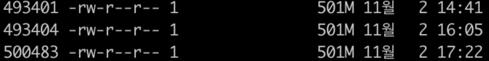
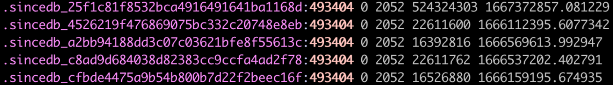

## 문제 현상

logback에 의해 log가 rolling 될 때 간헐적으로 rolling된 로그가 reproducing되는 이슈 발생  
예를 들어, a.log가 logback의 rolling 정책에 의해 a.log.yyyy-MM-dd로 rolling 되고 a.log 파일이 새로 생성되었을 때 rolling된 a.log.yyyy-MM-dd log가 reproducing 되는 이슈 발생  

## 원인 분석

해당 이슈는 log가 rolling 되는 시기에 맞춰서 발생하는 것으로 확인  
reproducing 되는 로그도 rolling된 log 파일 안에 존재하는 log임을 확인  



가운데 있는 inode 493404 파일이 rolling 될때 reproducing 되는 것을 확인  

> 참고로,  
> log가 rolling 되면 기존 log 파일은 rolling된 파일로 파일 명이 변경되고 log는 새로운 파일에 쓰인다.  
> a.log 파일은 rolling 되어 a.log.yyyy-MM-dd로 이름이 변경되고, 새로운 a.log 파일이 새로 생성된다.  
> 다시 말해,  
> rolling 되기 전 a.log 파일은 rolling 된 후 a.log.yyyy-MM-dd와 inode가 동일하고 새로 생성된 a.log 파일은 새로운 inode를 가진다.  



문제가 된 log 파일의 inode를 sinceDB에서 찾아보면 여러 곳에서 검색이 된 것을 확인 할 수 있다.  
sinceDB는 file input pattern이 변경될 때 함께 변경되는데, 사용되지 않는 sinceDB를 제외하고 보면 .sincedb_c8ad9d684038d82383cc9ccfa4ad2f78가 다른 log에서 사용되고 있는 input임을 확인 할 수 있었다.  
**inode가 재사용됨으로 발생하는 이슈가 아닌지 의심**  

## 재현

재현을 해보기 위해 동일한 logstash-oss 7.17.5 버전을 이용해 테스트를 진행  

```
# logstash conf

input {
    file {
        path => [ "/config/[0-9]" ]
        start_position => "beginning"
    }

    file {
        path => [ "/config/[a-z]" ]
        start_position => "beginning"
    }
}

output {
    stdout {
        codec => rubydebug {
            metadata => true
        }
    }
}
```

간단하게 0 ~ 9의 파일을 읽는 file input 하나와 a ~ z의 파일을 읽는 file input 이렇게 두 개를 준비하고 출력하는 설정을 생성했다.  
위 설정을 사용해 아래와 같은 시나리오로 테스트를 진행했다.  

> 동일한 inode의 log 파일을 생성하는 것은 어렵기 때문에 mv 명령어를 이용해 동일한 inode log 파일이 생성되었음 가정  
> rolling은 0 -> 9, a -> z 방향으로 일어나는 것으로 가정

```
# 시나리오

23302752 0 23302758 a                                           => 초기 inode
 
==> .sincedb_8f541e3dd05af5907e88c6e564435a64 <==
23302752 0 113 6537093 1667380872.233999 /config/0
 
==> .sincedb_db61ff9438ae2eb5fcbcc4015a4a7911 <==
23302758 0 113 16864343 1667380884.423104 /config/a
 
❯ mv 0 1                                                        => 숫자 로그 rolling 발생
23302752 1 23302758 a
 
==> .sincedb_8f541e3dd05af5907e88c6e564435a64 <==
23302752 0 113 6537093 1667380917.3088162 /config/1
 
==> .sincedb_db61ff9438ae2eb5fcbcc4015a4a7911 <==
23302758 0 113 16864343 1667380884.423104 /config/a
 
❯ cp 1 0                                                        => 새로운 로그가 0에 쓰임
23302812 0 23302752 1 23302758 a
 
==> .sincedb_8f541e3dd05af5907e88c6e564435a64 <==
23302752 0 113 6537093 1667380946.411415
23302812 0 113 0 1667380961.4750988 /config/0
 
==> .sincedb_db61ff9438ae2eb5fcbcc4015a4a7911 <==
23302758 0 113 16864343 1667380884.423104 /config/a
 
❯ mv a b                                                        => 알파벳 로그 rolling 발생
23302812 0 23302752 1 23302758 b
 
==> .sincedb_8f541e3dd05af5907e88c6e564435a64 <==
23302752 0 113 6537093 1667380946.411415
23302812 0 113 0 1667381036.818191 /config/0
 
==> .sincedb_db61ff9438ae2eb5fcbcc4015a4a7911 <==
23302758 0 113 16864343 1667381033.695263 /config/b
 
❯ mv 1 a                                                        => 숫자 로그 1번이 삭제되었고, 같은 inode로 알파벳 a로그 생성
23302812 0 23302752 a 23302758 b
 
==> .sincedb_8f541e3dd05af5907e88c6e564435a64 <==
23302752 0 113 6537093 1667380946.411415
23302812 0 113 0 1667381096.984185 /config/1
 
==> .sincedb_db61ff9438ae2eb5fcbcc4015a4a7911 <==
23302758 0 113 16864343 1667381093.806446 /config/b
 
❯ mv a c                                                        => 알파벳 로그 rolling 발생 -> c에서 재프로듀싱 발생
23302812 0 23302758 b 23302752 c
 
==> .sincedb_8f541e3dd05af5907e88c6e564435a64 <==
23302752 0 113 6537093 1667381139.050433
23302812 0 113 0 1667381171.107057 /config/1
 
==> .sincedb_db61ff9438ae2eb5fcbcc4015a4a7911 <==
23302758 0 113 16864343 1667381132.850267
23302752 0 113 6537093 1667381148.911427
23302812 0 113 6537093 1667381158.234427 /config/c
```

위의 시나리오로 테스트를 진행하자 rolling된 c log 파일에서 reproducing이 발생하는 것을 확인했다.  

## 결론

중복된 inode의 사용 및 sinceDB에 해당 inode가 남아있어서 발생하는 문제라고 결론을 내릴 수 있을 것 같다.  
이를 해결하기 위해선 이미 지워진 log 파일에 대해 sinceDB 정리가 이루어져야 한다.  
`sincedb_clean_after` 설정으로 sinceDB를 정리해 주긴 하는데 default가 2주로 되어있어서 rolling되어 제거되는 logback 설정에 맞춰 놓으면 해당 현상이 개선될 것으로 예상된다.  
추가적으로, 테스트를 진행하며 sinceDB에서 log 파일과 inode가 꼬이는 현상이 종종 발생하는 것을 볼 수 있었는데 logstash에서 reproducing 되는 것을 100% 방어하긴 어려울 것 같다. (file input plugin에서는 애매하면 그냥 다시 읽어버리게 되어있으므로)  

## 참조

[logstash file input plugins](https://www.elastic.co/guide/en/logstash/current/plugins-inputs-file.html)  
[inode-reuse-issue](https://www.elastic.co/guide/en/beats/filebeat/7.15/inode-reuse-issue.html)  
[logstash-input-file](https://github.com/logstash-plugins/logstash-input-file)  