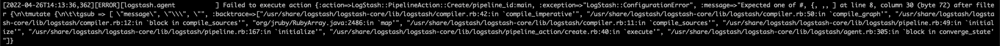

## 문제 현상

로그 개선 작업 중 json 포맷의 로그를 logstash에서 파싱하고 기타 작업을 거친 뒤에 kafka로 쏘는 파이프라인을 구성했다.
그리고 해당 파이프라인의 실패에 대해 로깅을 해서 살펴보던 중, json 파싱에 실패하는 케이스를 발견했다.

```
{"field": "/_\"}
```

위와 같은 케이스로, 역슬래시(\\)가 포함된 메시지의 경우 json 파싱이 실패했다.

---

## 삽질

역슬래시가 가지고 있는 특수성(특수 문자의 표현 등) 때문에 대부분의 언어에선 역슬래시를 두 번 반복(\\\\)해서 역슬래시를 표현한다.
이번 이슈도 마찬가지라고 생각이 들어서 역슬래시가 포함되면 역슬래시를 두 번 반복되게 메시지를 수정 후, json 파싱을 거친 후에 마지막 output을 태우기 전에 다시 역슬래시를 하나로 줄이면 될 것이라고 생각하고 작업에 들어갔다.

#### 역슬래시가 포함되면 역슬래시를 두 번 반복되게 메시지를 수정

filter에서 문자열 수정은 [logstash docs를 보면 mutate에 포함된 gsub](https://www.elastic.co/guide/en/logstash/current/plugins-filters-mutate.html#plugins-filters-mutate-gsub)을 사용한다.

```
filter {
	mutate {
		gsub => [ "field", "\", "\\" ]
	}
}
```



에러 발생. 역슬래시가 코드에 단 하나만 들어가서 그랬으리라. 단 하나로만 표현된 역슬래시를 특수성을 고려하여 2의 배수씩 "\\\\", "\\\\\\\\" 고쳐봤지만 역시나 동일한 에러가 발생했다. 그밖에 다양한 방법으로 시도했지만 제대로 동작하는 것이 없었다.

```
filter {
	mutate {
		gsub => [ "field", "\\", "\\\\" ]				# fail
		gsub => [ "field", "[\\]", "[\\][\\]" ]		# fail
		gsub => [ "field", "[\\]", "\\\\" ]			# fail
	}
}
```

다양한 시도와 [구글링](https://github.com/elastic/logstash/issues/3239#issuecomment-230258253)을 통해 역슬래시를 코드에 직접적으로 사용하게 되면 에러가 발생한다는 것과 정규식을 이용해야 한다는 것을 찾을 수 있었다. (logstash의 역슬래시와 관련된 대부분의 글은 역슬래시를 지우는 방법에 대해서만 논의되고 있었다)

```
filter {
	mutate {
		gsub => [ "field", "([\\])", "\1\1" ]
	}
}
```

> 정규식에서 소괄호()는 그룹을 의미하고 대괄호\[\]는 문자 하나를 의미한다. (\[\\\\\])는 역슬래시 하나의 문자를 그룹으로 본다는 말이다. \\1은 그룹을 지칭한다. 만약 (abc)(de) 이렇게 두 개의 그룹이 있을 경우 \\1는 (abc)를, \\2는 (de)를 나타낸다.

위와 같이 작성을 하게 되면 역슬래시를 두배로 뻥튀기시켜준다. \\ -> \\\\, \\\\ -> \\\\\\\\, \\\\\\ -> \\\\\\\\\\\\ ...
역슬래시가 두배로 뻥튀기가 되니 json 파싱이 문제없이 진행되었다.

#### 뻥튀기된 역슬래시를 다시 원래 모습으로

정상적으로 json이 파싱되는 것을 확인한 후 이제 다시 뻥튀기된 역슬래시를 절반으로 줄여 원래의 모습으로 바꿔야 한다고 생각했다.

문제는 위의 예제에선 json 필드가 단 하나지만 실제 로그에선 필드가 다양하고 많다는 것이다. 그리고 그 다양하고 많은 필드 중에 어느 필드에 역슬래시가 있는지 모르기 때문에 gsub 명령어에서 필드를 특정해서 처리가 불가능했다. 결론은 전체 필드를 순회하며 gsub을 적용해야 한다는 것이다. 그런데 문제는 doc에 어디를 봐도 전체 필드를 순회하면서 작업할 수 있는 plugin이 보이지 않았다는 것이다.

결국 구글링을 통해 ruby 코드를 사용해서 [전체 필드를 순회하며 작업을 하는 케이스](https://stackoverflow.com/questions/26878135/can-i-use-gsub-to-recursively-replace-all-fieldnames-with-another-field)를 발견할 수 있었다.

```
filter {
	ruby {
		code => "
			data = event.clone.to_hash
			data.each do |k, v|
				if v.instance_of? String
					event.set(k, v.gsub(/([\\])[\\]/, '\1'))
				end
			end
		"
	}
}
```

위와 같이 작업을 해서 돌려보니 동작을 하는 것 같으면서도 동작을 제대로 하지 않는 것 같기도 했다.
역슬래시를 하나만 넣을 경우 결과로 역슬래시가 두 개가 나왔고, \\ -> \\\\
역슬래시를 두 개 넣을 경우 결과로 역슬래시가 두 개 나왔고, \\\\ -> \\\\
역슬래시를 세 개 넣을 경우 결과로 역슬래시가 네 개 나왔고, \\\\\\ -> \\\\\\\\
역슬래시를 네 개 넣을 경우 결과로 역슬래시가 네 개 나왔다. \\\\\\\\ -> \\\\\\\\

---

## 결론

뻥튀기된 역슬래시를 줄이는 과정에서 이상하게 동작한 것은,

> 역슬래시 하나 (\\) -> 뻥튀기 (\\\\, 그러나 ruby에선 역슬래시 하나로 인식함) -> 코드 안 탐  
> 역슬래시 둘 (\\\\) -> 뻥튀기 (\\\\\\\\, 역슬래시 두 개로 인식) -> 하나로 줄임. 그러나 특수성 때문에 더블 역슬래시로 표현 -> \\\\  
> 역슬래시 셋 (\\\\\\) -> 뻥튀기 (\\\\\\\\\\\\, 역슬래시 세 개로 인식) -> 앞에 두 개는 하나로 줄임, 뒤에는 코드 안 탐 -> 역슬래시 두 개 -> \\\\\\\\  
> 역슬래시 넷 (\\\\\\\\) -> 뻥튀기 (\\\\\\\\\\\\\\\\, 역슬래시 네 개로 인식) -> 두 개로 줄임 -> \\\\\\\\

이런 현상이 아닐까 추측된다. 결론적으로 제일 처음으로 들어온 raw 메시지의 \\로 돌아가는 것은 무리로 보인다.

다음엔 logstash에서 kafka로 프로듀싱된 이 데이터를 kafka에서 컨슘 했을 때 어떻게 보이는지도 확인이 필요해 보인다.

---

## 덧

pipeline filter에서 대괄호(\[\])를 사용해서 field에 접근 할 수 있다. 그런데 대괄호 사이에 공백이 들어가게 되면 안된다.

작업하다가 json 포맷이 아닌것을 걸러낼려고 중괄호({)로 시작하지 않는 것은 다 drop 시켰는데 공백 실수를 해서 문제를 찾아 내는데 한참 걸렸다. 에러도 발생하지 않고 그냥 정상적으로 drop을 타버렸기 때문에...

```
filter {
	if [message] !~ "^{" { drop {} }		# 정상 동작
	if [ message ] !~ "^{" { drop {} }		# 모든 log drop
}
```